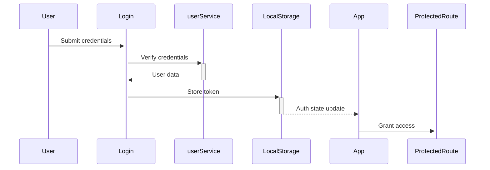

# Guerrilla Neuroscience

[](https://opensource.org/licenses/MIT)

A living archive for AI inference-time research, breaking free from institutional constraints and academic gatekeeping.

## Features

- 🔐 **JWT-based Authentication** (simulated via localStorage)
- 📚 **Research Article Management**
  - Create, browse, and search articles
  - Tag-based organization system
- 💬 **Community Collaboration**
  - Commenting system (stretch goal)
  - User voting (stretch goal)
- 🔍 **Advanced Search**
  - Full-text search across titles and content
  - Tag filtering

## Tech Stack

**Frontend:**
- React 18
- React Router 6
- Vite (Build Tool)
- CSS Modules

**Backend Simulation:**
- JSON Server (REST API mock)
- LocalStorage (Auth simulation)

## Project Structure

```
guerilla-neuroscience/
├── src/
│   ├── assets/
│   │   └── styles/          # Global styles
│   ├── components/
│   │   ├── auth/            # Auth components
│   │   ├── NavBar.jsx       # Navigation
│   │   └── ProtectedRoute.jsx # Auth HOC
│   ├── services/            # API services
│   ├── views/               # Page components
│   ├── App.jsx              # Main router
│   └── main.jsx             # App entry
├── db.json                  # JSON Server database
└── public/                  # Static assets
```

## Installation

1. Clone the repository:
   ```bash
   git clone https://github.com/yourusername/guerilla-neuroscience.git
   cd guerilla-neuroscience
   ```

2. Install dependencies:
   ```bash
   npm install
   ```

3. Start the development servers:
   ```bash
   # Terminal 1: Start Vite dev server
   npm run dev
   
   # Terminal 2: Start JSON Server
   json-server -w db.json -p 8088
   ```

## Available Scripts

- `npm run dev`: Start Vite development server
- `npm run build`: Create production build
- `npm run serve`: Preview production build
- `npm run test`: Run tests (to be implemented)

## Authentication Flow



## Environment Setup

Create `.env` file:

```ini
VITE_API_BASE=http://localhost:8088
VITE_APP_NAME=Guerrilla Neuroscience
```

## Stretch Goals

- [ ] OpenAI API integration
- [ ] Real-time collaboration
- [ ] PDF upload/parsing
- [ ] Citation management

## Contributing

1. Fork the project
2. Create your feature branch (`git checkout -b feature/AmazingFeature`)
3. Commit your changes (`git commit -m 'Add some AmazingFeature'`)
4. Push to the branch (`git push origin feature/AmazingFeature`)
5. Open a Pull Request

## License

Distributed under the MIT License. See `LICENSE` for more information.
